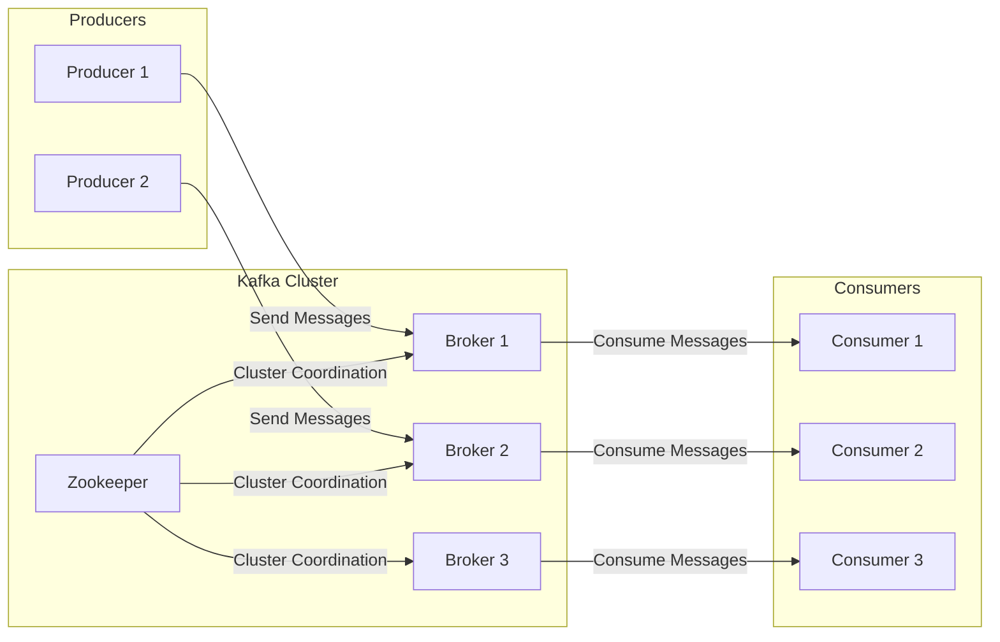

# kafka-workshop

### Explicação do Diagrama:

1. **Producers**:
    
    * **Producer 1 e Producer 2**: Aplicações cliente que enviam mensagens para os brokers do cluster Kafka.
2. **Kafka Cluster**:
    
    * **Zookeeper**: Coordena e gerencia o estado do cluster Kafka, colocado acima dos brokers.
    * **Brokers (Broker 1, Broker 2, Broker 3)**: Servidores Kafka que armazenam e gerenciam os dados. Eles recebem mensagens dos producers e as encaminham para os consumers.
3. **Consumers**:
    
    * **Consumer 1, Consumer 2, Consumer 3**: Aplicações cliente que consomem mensagens dos brokers.

### Fluxo de Dados:

* **Producers** enviam mensagens para os **Brokers**.
* **Brokers** armazenam as mensagens e se comunicam com o **Zookeeper** para coordenação.
* **Consumers** consomem mensagens dos **Brokers**.

Este diagrama organizado da esquerda para a direita e com o Zookeeper acima dos brokers dentro do Kafka Cluster ilustra claramente o fluxo de dados e a coordenação dentro do sistema.