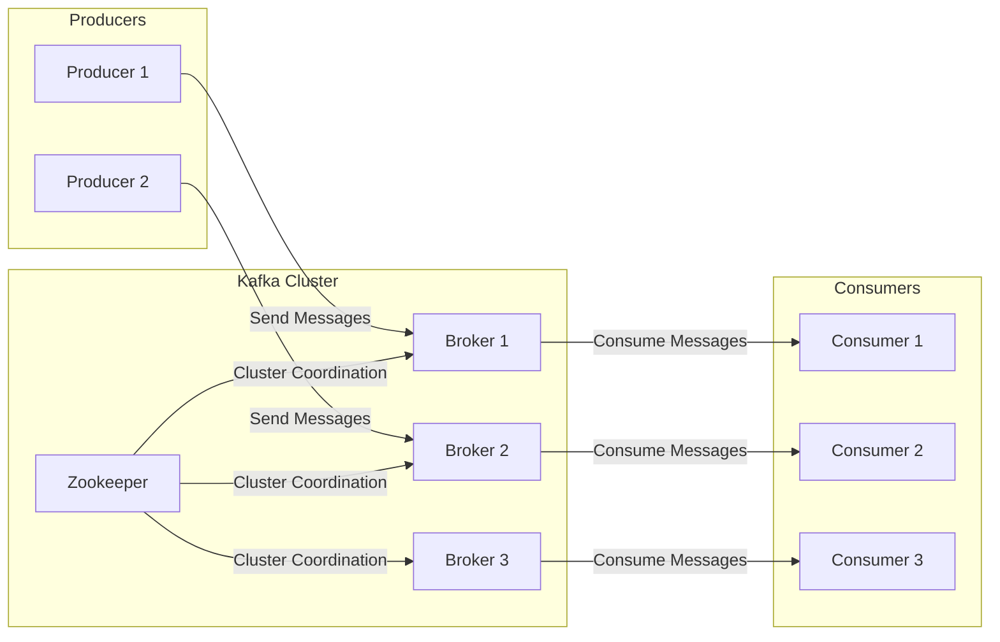

# kafka-workshop

# Projeto de Monitoramento de Transações Financeiras em Tempo Real com Apache Kafka

Bem-vindo ao projeto de monitoramento de transações financeiras em tempo real com Apache Kafka! Este projeto faz parte de um workshop prático exclusivo para os alunos da **Escola Jornada de Dados**.

## Sobre o Workshop

* **Data:** Sábado, 13 de julho
* **Horário:** 9:00 da manhã
* **Duração:** 4 horas
* **Público:** Exclusivo para alunos da Jornada de Dados

### Descrição do Workshop

Neste workshop prático, vamos desenvolver um sistema completo de monitoramento de transações financeiras em tempo real utilizando Apache Kafka e Python. Vamos explorar a arquitetura cliente-servidor do Kafka, configurar um cluster Kafka, e implementar producers e consumers para processar um grande volume de dados em tempo real.

### Objetivos do Projeto

1. **Configurar e entender a arquitetura do Apache Kafka.**
2. **Implementar producers que geram e enviam mensagens para um tópico Kafka.**
3. **Implementar consumers que consomem e processam mensagens de um tópico Kafka.**
4. **Monitorar e analisar um fluxo de transações financeiras simuladas.**

### Estrutura do Projeto

1. **Kafka Cluster**:
    
    * Zookeeper para coordenação.
    * Múltiplos brokers para armazenamento e gerenciamento de dados.
2. **Producers**:
    
    * Geram e enviam transações financeiras simuladas para um tópico Kafka.
3. **Consumers**:
    
    * Consomem e processam as transações do tópico Kafka.

### Arquitetura do Projeto

### Explicação do Diagrama:

1. **Producers**:
    
    * **Producer 1 e Producer 2**: Aplicações cliente que enviam mensagens para os brokers do cluster Kafka.
2. **Kafka Cluster**:
    
    * **Zookeeper**: Coordena e gerencia o estado do cluster Kafka, colocado acima dos brokers.
    * **Brokers (Broker 1, Broker 2, Broker 3)**: Servidores Kafka que armazenam e gerenciam os dados. Eles recebem mensagens dos producers e as encaminham para os consumers.
3. **Consumers**:
    
    * **Consumer 1, Consumer 2, Consumer 3**: Aplicações cliente que consomem mensagens dos brokers.

### Fluxo de Dados:

* **Producers** enviam mensagens para os **Brokers**.
* **Brokers** armazenam as mensagens e se comunicam com o **Zookeeper** para coordenação.
* **Consumers** consomem mensagens dos **Brokers**.

Este diagrama organizado da esquerda para a direita e com o Zookeeper acima dos brokers dentro do Kafka Cluster ilustra claramente o fluxo de dados e a coordenação dentro do sistema.

### Mais Informações

Para conhecer mais sobre a Escola Jornada de Dados e explorar outros cursos e workshops, visite o site:

https://suajornadadedados.com.br/

Estamos ansiosos para vê-lo no workshop!